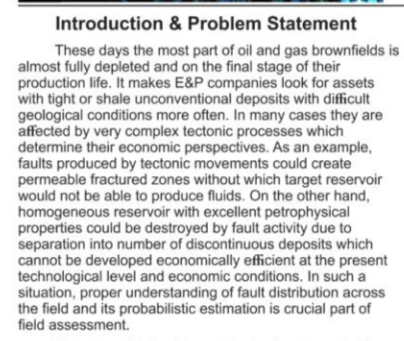
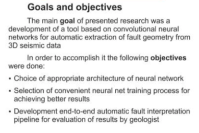
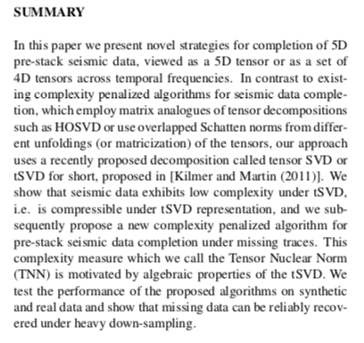
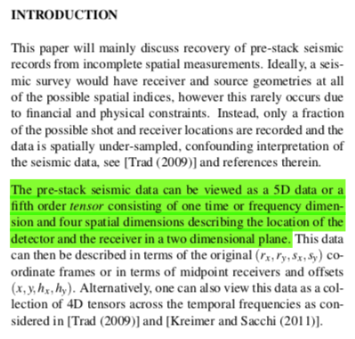

# Literature on 3D seismic cubes and deep learning

## Summary

### *Di2018 Developing a seismic pattern interpretation network (SpiNet) for automated seismic interpretation*

Filename: `Di2018 Developing a seismic pattern interpretation network (SpiNet) for automated seismic interpretation  1810.08517.pdf`

ABSTRACT

Seismic interpretation is now serving as a fundamental tool for depicting subsurface geology and assisting activities in various domains, such as environmental engineering and petroleum exploration. In the past decades, a number of computer-aided tools have been developed for accelerating the interpretation process and improving the interpretation accuracy. ==However, most of the existing interpretation techniques are designed for interpreting a certain seismic pattern (e.g., faults and salt domes) in a given seismic dataset at one time; correspondingly, the rest patterns would be ignored==. Interpreting all the important seismic patterns becomes feasible with the aid of multiple classification techniques. When implementing them into the seismic domain, however, the major drawback is the low efficiency particularly for a large dataset, since the classification need to be repeated at every seismic sample. ==To resolve such limitation, this study first present a seismic pattern interpretation dataset (SpiDat), which tentatively categorizes 12 commonly- observed seismic patterns based on their signal intensity and lateral geometry, including these of important geologic implications such as faults, salt domes, gas chimneys, and depositional sequences.== Then we propose a seismic pattern interpretation network (SpiNet) based on the state- of-the-art deconvolutional neural network, which is capable of automatically recognizing and annotating the 12 defined seismic patterns in real time. The impacts of the proposed SpiNet come in two folds. First, applying the SpiNet to a seismic cube allows interpreters to quickly identify the important seismic patterns as input to advanced interpretation and modeling. Second, the SpiNet paves the foundation for deriving more task-oriented seismic interpretation networks, such as fault detection. It is concluded that the proposed SpiNet holds great potentials for assisting the major seismic interpretation challenges and advancing it further towards cognitive seismic data analysis. Meanwhile, more work is expected for evolving the SpiNet by integrating transfer learning, defining more seismic patterns, feeding more seismic datasets and training labels, and optimizing the network architectures.

----

### *Egorov2019 Automatic Fault interpretation from seismic data via convolutional neural networks*

Filename: `Egorov2019 Automatic Fault interpretation from seismic data via convolutional neural networks [poster].pdf`

 

-----

### Ely2013 5D and 4D Pre-stack seismic data completion using tensor nuclear norm (TNN).pdf

Filename: `ely2013 5D and 4D Pre-stack seismic data completion using tensor nuclear norm (TNN).pdf`

	

----

### Gasperini2009 SEISPRHO: An interactive computer program for processing and interpretation of high-resolution seismic reflection profiles

Filename: `gasperini2009 SEISPRHO— An interactive computer program for processing and interpretation of high-resolution seismic reflection profiles.pdf`

**ABSTRACT**

**SeisPrho** is an interactive computer program for processing and interpreting high-resolution seismic reflection profiles developed using the Delphi/Kylix multiplatform programming environment. For this reason, it is available under WindowsTM and LinuxTM operating systems. The program allows the users to handle SEG-Y data files (and other non-standard formats) carrying out a processing sequence over the data to obtain, as a final result, bitmap images of seismic sections. Some basic algorithms are implemented, including filtering and deconvolution. However, the main feature of SEISPRHO is its interactive graphic interface, which provides the user with several tools for interpreting the data, such as reflector picking and map digitizing. Moreover, the program allows importing and geo-referencing maps and seismic profiles in the form of digital images. Trace-by-trace analysis of seismic signal and sea-bottom reflectivity is also implemented, as well as other special functions such as compilation of time-slice maps from close-spaced grids of seismic lines. SEISPRHO is distributed as public domain software for non-commercial purposes by the Marine Geology division of the Istituto di Scienze Marine (ISMAR-CNR). This paper is an introduction to the program and a preliminary guide to the users.

----

### Greenspan2016 Deep Learning in Medical Imaging

Filename: `greenspan2016 Deep Learning in Medical Imaging.pdf`

**ABSTRACT**

Deep learning is a growing trend in general data analysis and has been termed one of the 10 breakthrough technolo- gies of 2013 [1]. Deep learning is an improvement of artificial neural networks, consisting of more layers that permit higher levels of abstraction and improved predictions from data [2]. To date, it is emerging as the leading machine-learning tool in the general imaging and computer vision domains.

In particular, convolutional neural networks (CNNs) have proven to be powerful tools for a broad range of computer vision tasks. Deep CNNs automatically learn mid-level and high-level abstractions obtained from raw data (e.g., images). Recent results indicate that the generic descriptors extracted from CNNs are extremely effective in object recognition and localization in natural images. Medical image analysis groups across the world are quickly entering the field and applying CNNs and other deep learning methodologies to a wide variety of applications. Promising results are emerging.

In medical imaging, the accurate diagnosis and/or assessment of a disease depends on both image acquisition and image in- terpretation. Image acquisition has improved substantially over recent years, with devices acquiring data at faster rates and in- creased resolution. The image interpretation process, however, has only recently begun to benefit from computer technology. Most interpretations of medical images are performed by physi- cians; however, image interpretation by humans is limited due to its subjectivity, large variations across interpreters, and fatigue. Many diagnostic tasks require an initial search process to detect abnormalities, and to quantify measurements and changes over time. Computerized tools, specifically image analysis and machine learning, are the key enablers to improve diagnosis, by facilitating identification of the findings that require treat- ment and to support the expert’s workflow. Among these tools, deep learning is rapidly proving to be the state-of-the-art foun- dation, leading to improved accuracy. It has also opened up new frontiers in data analysis with rates of progress not before experienced.

----

### Imhof2003 Seismic Determination of reservoir Heterogeneity-- Characterization of Heavey Oil Reservoirs

Filename: `Imhof2003 Seismic Determination of reservoir Heterogeneity-- Characterization of Heavey Oil Reservoirs.pdf`

-----

### Keynejad2018 Application of Machine Learning Algorithms in Hydrocarbon Exploration and Reservoir Characterization

Filename: `Keynejad2018 Application of Machine Learning Algorithms in Hydrocarbon Exploration and Reservoir Characterization  azu_etd_16481_sip1_m [repaired thesis].pdf`

-----

### Milletari2016 Fully Convolutional Neural Networks for  Volumetric Medical Image Segmentation

Filename: `Milletari2016 Fully Convolutional Neural Networks for  Volumetric Medical Image Segmentation 1606.04797.pdf`

-----

### Mohebian2017 A Comparative Study of the Neural Network, Fuzzy Logic, and Neuro-fuzzy Systems in Seismic Reservoir Characterization

Filename: `Mohebian2017 A Comparative Study of the Neural Network, Fuzzy Logic, and Neuro-fuzzy Systems in Seismic Reservoir Characterization.pdf`

-----

### Naeini2018 Seismic - learning from machines

Filename: `naeini2018 Seismic - learning from machines.pdf`

-----

### Segy-change— The swiss army knife for the SEG-Y files

Filename: `Segy-change— The swiss army knife for the SEG-Y files.pdf`

-----

### SLC Paris 2014_Seismic Standards in the SLC_SEG.pdf

Filename: `SLC Paris 2014_Seismic Standards in the SLC_SEG.pdf`

-----

### Wu2018Cnnf Convolutional neural networks for fault interpretation in seismic images.pdf

Filename: `wu2018Cnnf Convolutional neural networks for fault interpretation in seismic images.pdf`

-----

### Wu2019 FaultNet3D: Predicting Fault Probabilities, Strikes, and Dips With a Single Convolutional Neural Network

Filename: `wu2019 FaultNet3D— Predicting Fault Probabilities, Strikes, and Dips With a Single Convolutional Neural Network [resized].pdf`

-----

### Xiong2018 Seismic fault detection with convolutional neural networks.pdf

Filename: `xiong2018 Seismic fault detection with convolutional neural networks.pdf`

